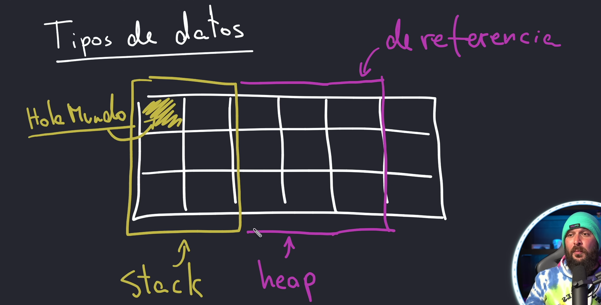
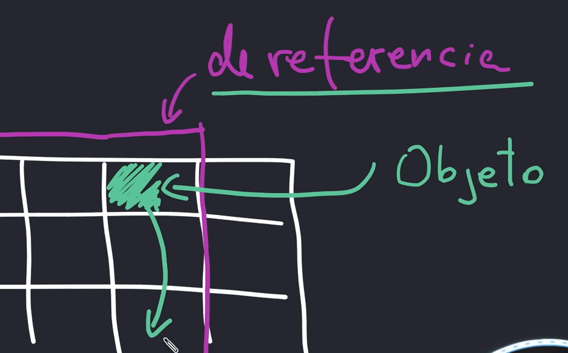

# Tipos de datos

### Primitivos (stack) / Referencia (Heap)

#### Memoria Heap
    Es mas lenta que stack
    Es dinamica.
    Se guardan objetos, no datos mismos

#### Primitivos 

###### Cuando busquemos en memoria.
El dato siempre lo vamos a encontrar el el bloque que le fue asignado.

#### De Referencia

###### Cuando busquemos en memoria.
El dato vamos a saltar en bloques de memoria.
