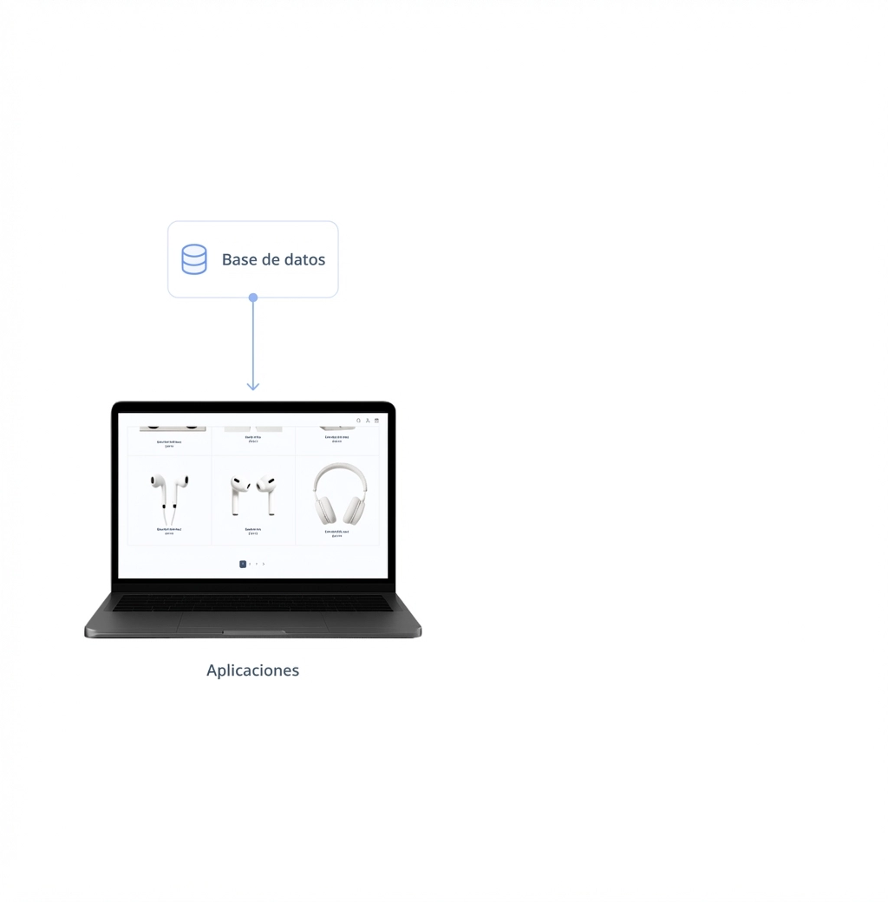
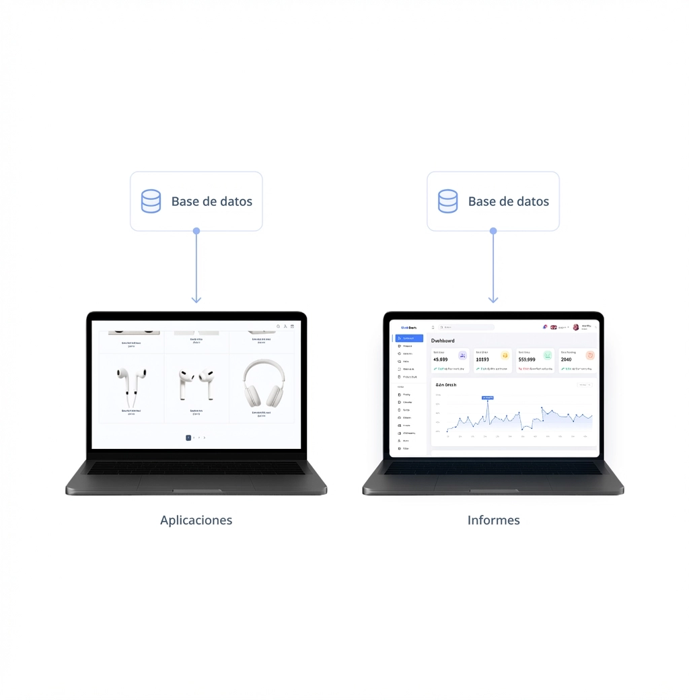
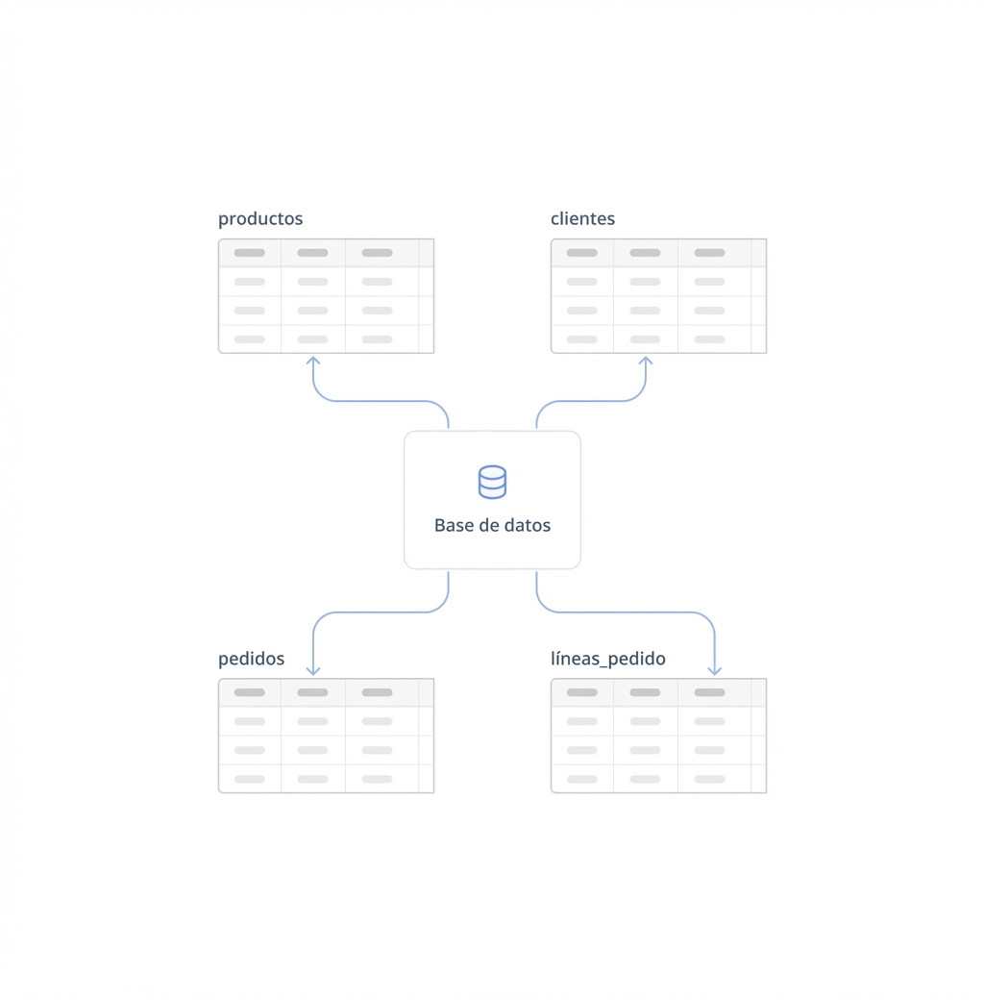
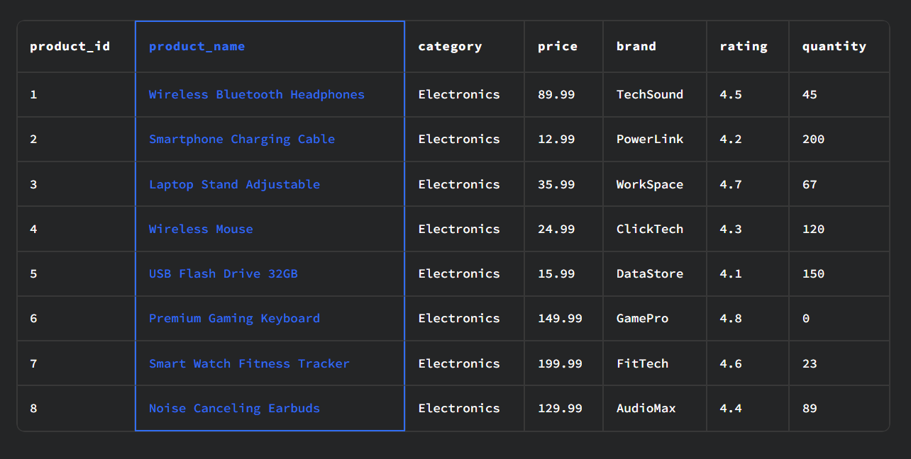

# SQL

SQL (que se pronuncia "es-cu-ele" o "siquel") significa Structured Query Language. Es el lenguaje de programación más utilizado para trabajar con datos en bases de datos.

En su uso más común, escribes un fragmento de código SQL llamado Consulta SQL que le pide información específica a la base de datos, y esta te devuelve los resultados que solicitaste.

#### Que es una Base de datos.

una base de datos es un sistema para gestionar datos que nos permite:

1. Almacenar datos de forma confiable
2. Recuperar información eficientemente
3. Manipular datos sistemáticamente

la base de datos almacena todo: usuarios registrados, sus preferencias, el contenido que crean, las transacciones que realizan. Cada vez que un usuario inicia sesión o realiza una acción, tu aplicación consulta la base de datos para obtener o guardar información.

Además de impulsar aplicaciones, las bases de datos también son fundamentales para el análisis y la toma de decisiones.

Todos los informes y análisis de datos que permiten decisiones basadas en datos en una organización típicamente provienen de datos almacenados en bases de datos.

Por ejemplo, cuando necesitas analizar información de usuarios para mejorar tu aplicación, o generar reportes sobre el rendimiento del sistema, estás consultando datos de la base de datos para extraer insights valiosos.

El tipo de base de datos más popular es una base de datos relacional. En ella, los datos se organizan en tablas, donde cada tabla representa un tipo específico de entidad o evento.

Una base de datos para una empresa de e-commerce típicamente consta de tablas para:

products - información sobre los productos disponibles para venta
customers - información sobre usuarios registrados
orders - información sobre compras de clientes
order_items - información sobre productos individuales en cada pedido
En desarrollo fullstack, diseñarías tablas similares: una tabla users para autenticación, posts para contenido, comments para interacciones, etc.

1- ¿Qué es una base de datos?

    Un sistema para almacenar, recuperar y manipular datos

2- ¿Para qué se utiliza principalmente una base de datos?

    Sustentar aplicaciones y permitir el análisis y la elaboración de informes

Gestionar sistemas de correo electrónico y calendarios

3- ¿De qué se componen las bases de datos relacionales?

    Tablas

#### Filas

Nuestra tabla principal de productos contiene información sobre todos los productos disponibles para venta.

**Las tablas están compuestas de filas y columnas.**

Cada fila representa una entidad o evento único y contiene toda la información sobre esa entidad. Aquí, la fila resaltada representa un producto específico: los Wireless Bluetooth Headphones.

En desarrollo fullstack, por ejemplo, cada fila en tu tabla users representaría un usuario único con toda su información: email, contraseña hasheada, fecha de registro, etc.

#### Columnas.
Cada columna representa un atributo o propiedad específica de la entidad representada por la tabla y tiene un nombre descriptivo.

Aquí, la columna resaltada product_name contiene los nombres de todos los productos. Cada columna captura un aspecto diferente: price, brand, rating, etc.

En tu tabla users, tendrías columnas como username, email, created_at—cada una capturando un atributo específico del usuario.

Estas tablas pueden parecer similares a cómo se organizan los datos en hojas de cálculo (de Excel o Google Sheets), pero las bases de datos sirven para casos de uso completamente diferentes y son mucho más poderosas.

Las bases de datos están diseñadas para manejar cantidades mucho mayores de datos (millones o miles de millones de filas), permitir que miles de usuarios accedan y actualicen datos simultáneamente, y están optimizadas para acceso automatizado por aplicaciones—capacidades que las hojas de cálculo simplemente no pueden proporcionar.

#### Diferencia entre CSV y BD.

Un CSV es simplemente un archivo de texto con datos separados por comas. Es estático y limitado:

    Solo puede ser editado por una persona a la vez
    No tiene seguridad ni control de acceso
    No valida datos automáticamente
    Se vuelve lento con muchos datos

Una base de datos es un sistema completo que:

    Permite miles de usuarios simultáneos sin conflictos
    Tiene autenticación y permisos (quién puede ver/modificar qué)
    Valida datos automáticamente (tipos, restricciones)
    Mantiene rendimiento rápido incluso con millones de filas
    Permite consultas complejas con SQL

En desarrollo fullstack, usarías un CSV para exportar datos temporalmente, pero nunca como sistema principal. Tu aplicación necesita una base de datos real para manejar usuarios concurrentes, transacciones seguras y consultas eficientes.

> cada fila representa una entidad única (un cliente con toda su información) y que cada columna representa un atributo específico (como nombre, email, ciudad).

### Resumen.

#### Bases de datos

Una base de datos es un sistema de gestión de datos que nos permite almacenar datos de forma fiable, recuperar información de manera eficiente y manipular datos sistemáticamente.

Las bases de datos impulsan aplicaciones web, móviles y de otro tipo, así como el análisis de datos y la elaboración de informes.

#### Organización de los datos

Los datos en una base de datos se organizan en tablas con filas y columnas.
Las filas representan entidades o eventos individuales.
Las columnas representan atributos o propiedades específicos.

#### Conceptos básicos de SQL

Structured Query Language (SQL) es el lenguaje de programación más utilizado para trabajar con datos en bases de datos.

En su uso más común, escribes código SQL para solicitar datos a las bases de datos y estas devuelven los resultados que necesitas.

SQL es mucho más sencillo que los lenguajes de programación de propósito general porque está diseñado para un propósito específico: trabajar con datos.